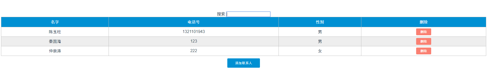
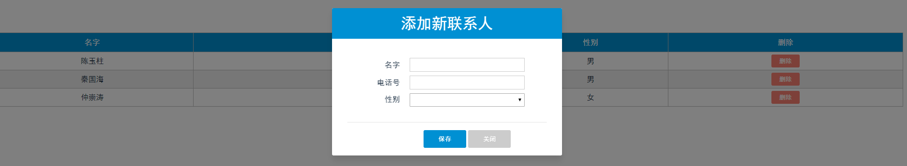
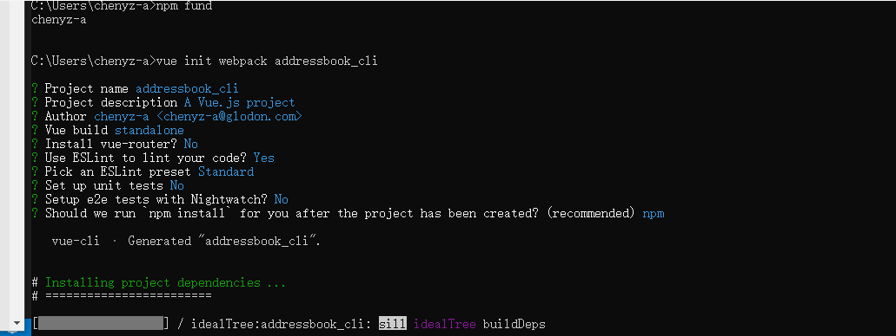
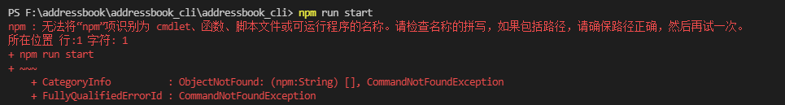
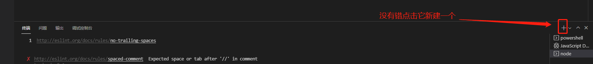
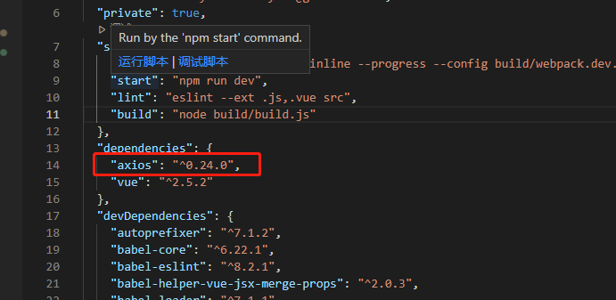

# 通讯录手脚架学习记录

### 项目简介
*第一个vue学习小项目，简单的通讯录前端实现，实现了显示联系人，创建联系人，删除联系人等功能。*
[前端GitHub上代码地址](https://github.com/chenyuzhu2018/addressbook_cli)
[服务端GitHub上代码地址](https://github.com/chenyuzhu2018/addressbook_server)
**主界面**


**添加联系人界面**


### 安装node
**第一步：下载安装包**
下载地址：[Node下载](https://nodejs.org/zh-cn/download/)
一直下一步即可

### 安装cli
#### Vue-cli2.0
**第一步：全局安装vue-cli**
``` bat
npm install vue-cli -g
```

**第二步：基于webpack创建项目**
``` bat
vue init webpack project(项目名称)
```
*配置选择项, 按需要设置即可*
```
Project name (my-project) # 项目名称（我的项目，名称不能大写）

Project description (A Vue.js project) # 项目描述一个Vue.js 项目

Author 作者（你的名字）

Install vue-router? (Y/n) # 是否安装Vue路由，也就是以后是spa（但页面应用需要的模块）

Use ESLint to lint your code? (Y/n) # 使用 ESLint 到你的代码？ （Y [ yes ] / N [ no ]）

Pick an ESLint preset (Use arrow keys) # 选择一个预置ESLint（使用箭头键）

Setup unit tests with Karma + Mocha? (Y/n) # 设置单元测Karma + Mocha？ （Y/ N）

Setup e2e tests with Nightwatch? (Y/n) # 设置端到端测试，Nightwatch？ （Y/ N）
```

**第三步：运行程序**
``` bat
npm run dev
``` 

#### Vue-cli3.0
**第一步：删除以前安装的vue-cli2.0**
``` bat
npm uninstall vue-cli
```
**第二步：全局安装vue-cli3.0**
``` bat
npm install @vue/cli -g
```
**第三步：创建项目**
``` bat
vue create project（项目名称）
```

### 遇到的问题
1. 无法在vscode终端下执行npm命令下图，


* 解决办法： 
试了很多办法包括
   - 管理员运行
   - 更新node版本
   - 添加环境变量

*然鹅都不行、、、*

* 真正解决办法：
新建一个终端就好了，，，，，，，下图

2. npm 过慢
### 学习记录
1. for in  循环在java是元素在JavaScript中是下标
3. axios 安装
    ``` bat
    npm install axios --save
    ```
    

